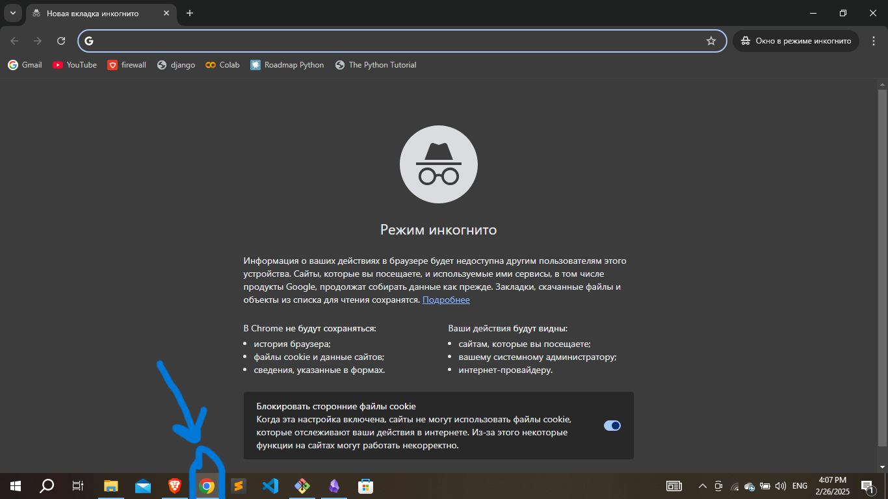
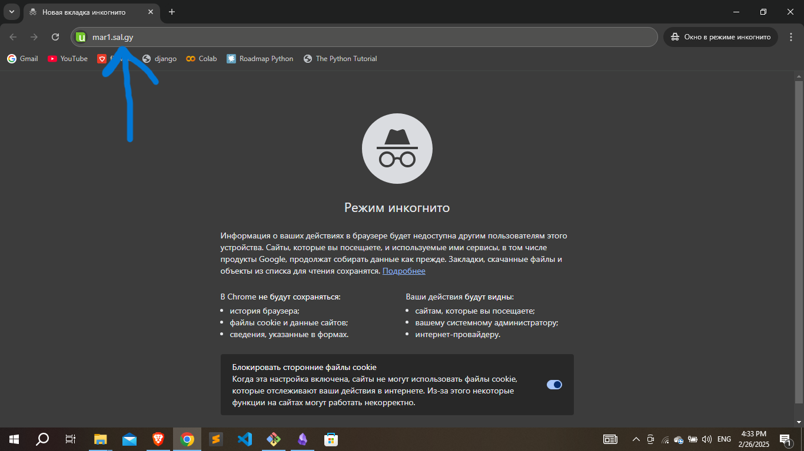
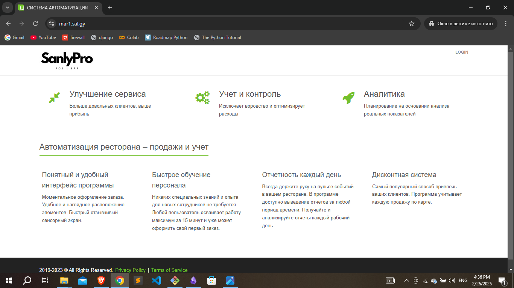
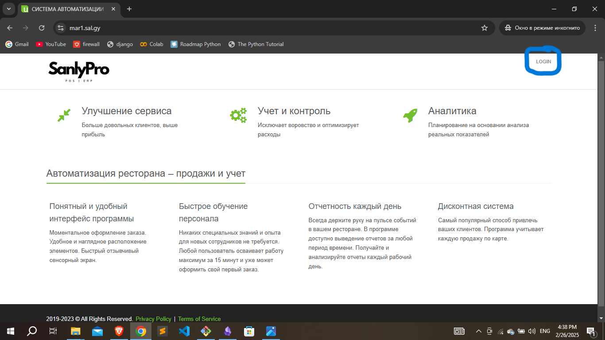
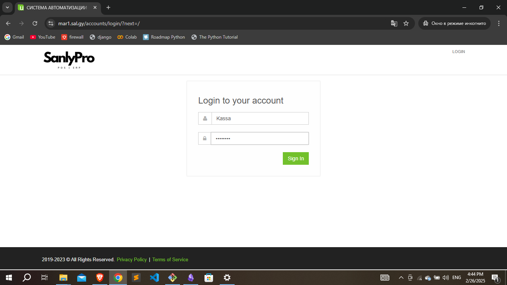
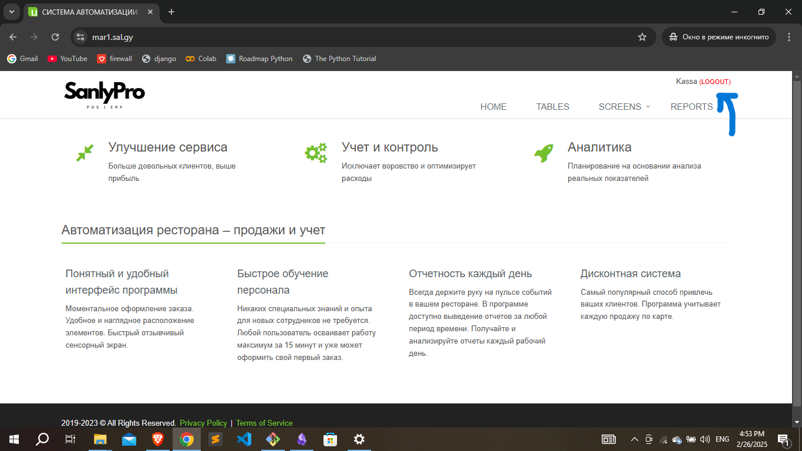

### 1. Programma girmek ucin ilki bilen kompyuterynyz-dan Chrome browsery acmaly.

### 2. Chrome browsery acan bolsanyz indi siz yokarda yerlesen gozleg gutusyna size berilen web programmanyn url-yny yazyn. (Asakda gorlezilisi yaly yazyn we Enter duwmesine basyn.)

### 3. Egerde siz mundan on yerine yetirilen buyruklary dogry yerine yetiren bolsanyz onda siz su asakdaky web sahypasyna gecersiniz.

### 4. Indi bolsa siz Programma upjunculigine registrasiya etmeli bolorsynyz. Programmany ulanmak ucin ilki basda log in yagny registrasiya etmeli bolorsynyz. Asakda gorkezilen LOGIN duwmesine basyn.

### 5. Indi bolsa sul asakdaky yaly 2 gutuly yer acylar bul iki gutynyn yokarsyna size berilen Ulanyjynyn adyny yazmaly asakdakysyna bolsa Kodyny (*dine size berilen ady we kody yazyn*).
### MYSAL: 
### Ulanyjy ady: Kassa | Ulanyjy kody: 1234@kod
### Gutulara size berilen ady we kody yazan bolsanyz, yasyl sign in duwmesine basyn.

### 6. Egerde siz yokarda gorkezilen ahli tapgyrlary yerine yetiren bolsanyz programma sizi esasy sahypa ugrukdyrar. Egerde siz dogry log in (registrasiya) edeninizi barlajak bolsanyz onda yanky LOGIN duwmesinin yerine siz oz adynyzy gorersiniz.

### 7. Egerde programmanyzyn yuzi yokarda gorkezilen suratdaky yaly bolsa onda siz ustunlikli programma girdiniz diymekligi anladyar. ! Dusunmeyan yerleriniz bar bolsa programmistlar bilen habarlasyp bilersiniz.